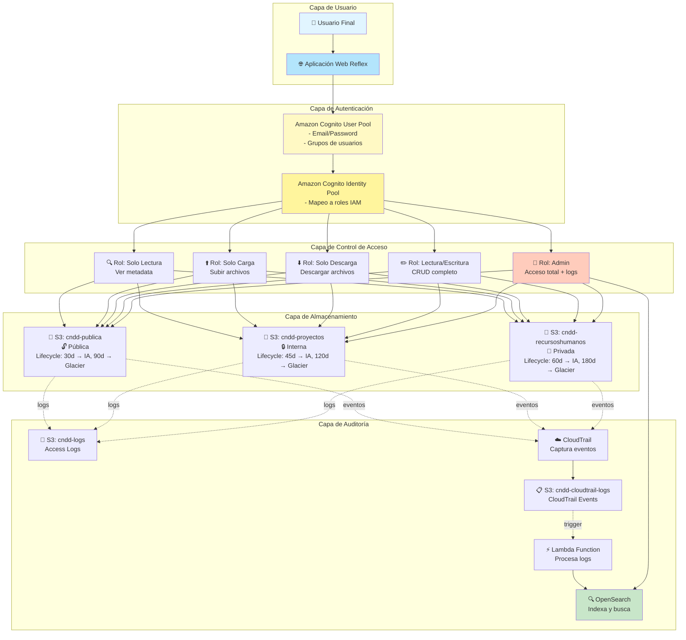
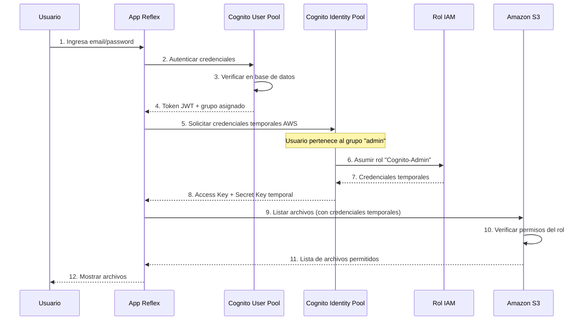
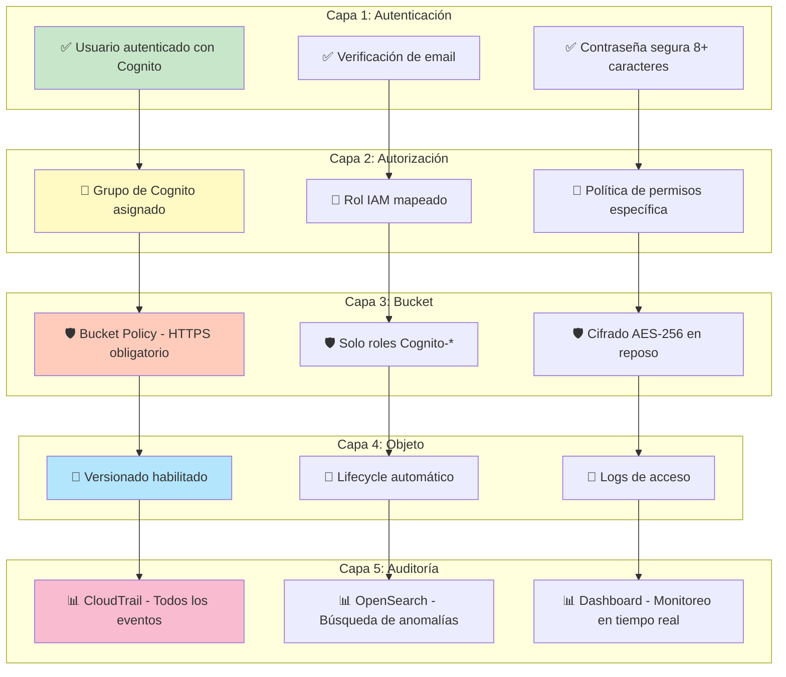

# Diagramas de Arquitectura - Sistema CNDD Storage

## 1. Arquitectura General del Sistema

---

## 2. Flujo de Autenticación y Autorización

---

## 3. Flujo de Auditoría con OpenSearch

```mermaid
graph LR
    subgraph "Generación de Eventos"
        U[👤 Usuario<br/>Sube archivo]
        S3[📁 S3 Bucket]
    end

    subgraph "Captura"
        CT[☁️ CloudTrail<br/>Registra evento]
        CTB[📋 Bucket CloudTrail<br/>cndd-cloudtrail-logs]
    end

    subgraph "Procesamiento"
        LM[⚡ Lambda<br/>Se activa con S3 trigger]
        PROC[🔄 Procesa JSON.GZ<br/>Extrae datos]
    end

    subgraph "Indexación"
        OS[🔍 OpenSearch<br/>Indexa documento]
        IDX[(📊 Índice:<br/>cloudtrail-logs)]
    end

    subgraph "Visualización"
        DASH[📈 Dashboard<br/>Panel de Admin]
        ADM[👑 Administrador]
    end

    U -->|PutObject| S3
    S3 -.evento.-> CT
    CT -->|Escribe log| CTB
    CTB -->|Trigger| LM
    LM --> PROC
    PROC -->|Index| OS
    OS --> IDX
    IDX --> DASH
    DASH --> ADM

    style U fill:#e1f5ff
    style CT fill:#fff9c4
    style LM fill:#ffccbc
    style OS fill:#c8e6c9
    style DASH fill:#f8bbd0
```

---

## 4. Diagrama de Seguridad por Capas

---

## Leyenda de Iconos

- 👤 Usuario
- 🌐 Aplicación Web
- ☁️ Servicios AWS
- 📁 Almacenamiento S3
- 🔍 Solo Lectura
- ⬆️ Solo Carga
- ⬇️ Solo Descarga
- ✏️ Lectura/Escritura
- 👑 Administrador
- ⚡ Procesamiento Lambda
- 📊 Análisis y Búsqueda
- 🔐 Seguridad Alta
- 🔒 Seguridad Media
- 🔓 Seguridad Básica
- ✅ Verificado/Aprobado
- 🛡️ Protección activa
